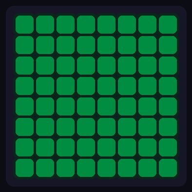
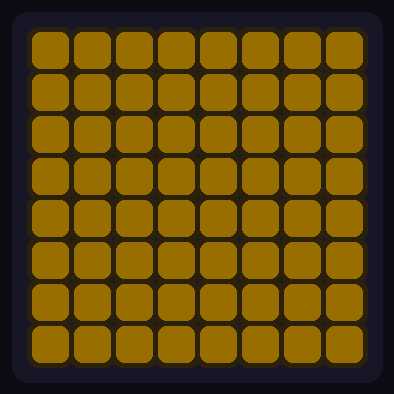
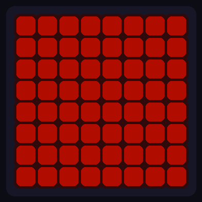

# ESP32-S3 Internet Monitor

An ESP32-S3 internet connectivity monitor with an 8x8 RGB LED matrix. Checks your connection every 10 seconds and displays status through color-coded animations — green when online, yellow when degraded, red when down. Features 18 animated effects, MQTT integration for Home Assistant, and a secure web dashboard.

<p align="center">
  
  
  
  <br>
  <b>Online</b> &nbsp;&nbsp;&nbsp;&nbsp;&nbsp;&nbsp;&nbsp;&nbsp;&nbsp;&nbsp;&nbsp;&nbsp;&nbsp;&nbsp;&nbsp;&nbsp;&nbsp;&nbsp;&nbsp;&nbsp;&nbsp;&nbsp;&nbsp;&nbsp;
  <b>Degraded</b> &nbsp;&nbsp;&nbsp;&nbsp;&nbsp;&nbsp;&nbsp;&nbsp;&nbsp;&nbsp;&nbsp;&nbsp;&nbsp;&nbsp;&nbsp;&nbsp;&nbsp;&nbsp;&nbsp;&nbsp;&nbsp;&nbsp;&nbsp;
  <b>Offline</b>
</p>

## Contents

- [Features](#features)
- [Hardware](#hardware)
- [Quick Start](#quick-start)
- [Web Interface](#web-interface)
- [MQTT & Home Assistant](#mqtt--home-assistant)
- [LED Effects](#led-effects)
- [Configuration](#configuration)
- [API Reference](#api-reference)
- [OTA Updates](#ota-updates)
- [Factory Reset](#factory-reset)
- [Troubleshooting](#troubleshooting)

## Features

- **Dual-core architecture** — LED effects on Core 0 (60fps), network on Core 1
- **At-a-glance status** — color-coded LED matrix shows connection state instantly
- **18 LED effects** — from simple solid colors to Conway's Game of Life
- **MQTT integration** — publish status to Home Assistant, Prometheus, or any broker
- **Home Assistant auto-discovery** — entities appear automatically
- **Secure web dashboard** — SHA-256 password hashing, rate-limited login
- **Config portal** — captive portal for WiFi setup (no hardcoded credentials needed)
- **Hardware factory reset** — hold BOOT button for 5 seconds to reset all settings
- **OTA updates** — update firmware over WiFi
- **Persistent settings** — brightness, effect, speed, rotation survive reboot
- **Watchdog timer** — auto-reboots if device hangs

## Hardware

[Waveshare ESP32-S3-Matrix](https://www.waveshare.com/esp32-s3-matrix.htm) — ESP32-S3 with built-in 8x8 WS2812B LED matrix.


> ⚠️ **Keep brightness ≤50** to prevent overheating.

## Quick Start

1. **Arduino IDE Setup:** Follow the [Waveshare Wiki Guide](https://www.waveshare.com/wiki/ESP32-S3-Matrix#Working_with_Arduino)

2. **Download:** Clone or download this repo. Rename folder to `InternetMonitor` (must match .ino filename)

3. **Install Libraries** (Tools → Manage Libraries):
   - Adafruit NeoPixel
   - PubSubClient
   - ArduinoJson

4. **Upload:** Flash to board via USB

5. **First-Run Setup:**
   - Device starts in AP mode (purple LED)
   - Connect to WiFi network `InternetMonitor-Setup` (open network, no password)
   - Browser opens automatically (or go to `192.168.4.1`)
   - Select your WiFi network and enter password
   - Optionally set a dashboard password (default: `admin`)
   - Device reboots and connects to your network

6. **Access Dashboard:** Device shows green when online. Find IP in Serial Monitor or router, open in browser.

> **Alternative:** Pre-configure WiFi in `config.h` before uploading to skip the setup portal.

## Web Interface

### Config Portal (First Run)

When no WiFi is configured, device creates an access point for setup.


- **AP Name:** `InternetMonitor-Setup`
- **AP Security:** Open (no password)
- **Portal IP:** `192.168.4.1`

The portal scans for networks and lets you select one to join. After saving credentials, device reboots and connects.

### Dashboard (Normal Operation)

Access via device IP. Login with your configured password.


**Controls:**
- Effect selection (18 effects in 3 categories)
- Brightness (5-50), Speed (10-100%), Rotation (0°/90°/180°/270°)
- MQTT configuration tab
- Factory reset (returns to config portal)

**Statistics:** Uptime, success rate, failed checks, downtime, WiFi signal, CPU temp

**Security:** Passwords stored as SHA-256 hash. Rate limiting locks out after 5 failed attempts.

## MQTT & Home Assistant

Publish device status to any MQTT broker. Configure via the web dashboard's MQTT tab.

### Configuration

| Setting | Default | Description |
|---------|---------|-------------|
| Broker | — | Hostname or IP of MQTT broker |
| Port | 1883 | Broker port |
| Username/Password | — | Optional authentication |
| Base Topic | `internet_monitor` | Prefix for all topics |
| Interval | 30s | Publish frequency |
| HA Discovery | Off | Auto-register with Home Assistant |

### Topics

| Topic | Description |
|-------|-------------|
| `{base}/state` | JSON status payload (retained) |
| `{base}/availability` | `online` or `offline` (LWT) |

### Home Assistant

Enable "HA Discovery" to automatically create these entities:

- **Connectivity** (binary sensor) — online/offline
- **Status** — state text (Online, Degraded, Down, etc.)
- **Uptime** — seconds since boot
- **Success Rate** — percentage
- **WiFi Signal** — RSSI in dBm
- **CPU Temperature** — degrees Celsius
- **Failed Checks** — count
- **Total Downtime** — seconds

Entities appear under `sensor.internet_monitor_*` after enabling discovery.

### JSON Payload

```json
{
  "status": "online",
  "state": 4,
  "state_text": "Online",
  "uptime_seconds": 86400,
  "success_rate": 99.8,
  "wifi_rssi": -52,
  "temperature": 42.5
}
```

## LED Effects

| Category | Effects |
|----------|---------|
| **Basic** | Off, Solid, Ripple, Rainbow, Pulse, Rain |
| **Visual** | Matrix, Fire, Plasma, Ocean, Nebula, Noise |
| **Animated** | Life, Pong, Metaballs, Interference, Pool, Rings, Ball |

Effects change color based on connectivity state (green → yellow → red).

<details>
<summary><b>Effect Previews</b></summary>

| Effect | Online | Degraded | Offline |
|:-------|:------:|:--------:|:-------:|
| **Rain** |  |  |  |
| **Pulse** |  |  |  |
| **Ripple** |  |  |  |

</details>

### State Colors

| State | Color | Description |
|-------|-------|-------------|
| Booting | 🔵 Blue | System starting |
| Connecting | 🔵 Cyan | WiFi connecting |
| Config Portal | 🟣 Purple | AP mode, awaiting setup |
| Online | 🟢 Green | Internet OK |
| Degraded | 🟡 Yellow | 1 check failed |
| Offline | 🟠 Orange | 2+ consecutive failures |
| WiFi Lost | 🔴 Red | WiFi disconnected |

## Configuration

Most settings are configured via the web interface. Optionally, edit `config.h` before uploading to pre-configure:

```cpp
// WiFi (leave blank to use config portal instead)
const char* WIFI_SSID     = "";
const char* WIFI_PASSWORD = "";

// Web dashboard password (leave blank to set via portal)
const char* WEB_PASSWORD  = "admin";

// Timing
#define CHECK_INTERVAL       10000  // Check every 10 seconds
#define FAILURES_BEFORE_RED  2      // Consecutive failures before "down"
```

## API Reference

All endpoints except `/login` require session authentication.

| Endpoint | Method | Description |
|----------|--------|-------------|
| `/` | GET | Dashboard or login page |
| `/login` | POST | Authenticate (`password=xxx`) |
| `/logout` | GET | End session |
| `/stats` | GET | JSON statistics |
| `/effect?e={0-17}` | GET | Set effect |
| `/brightness?b={5-50}` | GET | Set brightness |
| `/speed?s={10-100}` | GET | Set speed |
| `/rotation?r={0-3}` | GET | Set rotation |
| `/factory-reset` | GET | Clear settings, reboot |
| `/mqtt/config` | GET | Get MQTT configuration |
| `/mqtt/config` | POST | Save MQTT configuration |
| `/mqtt/status` | GET | MQTT connection status |
| `/mqtt/test` | POST | Test MQTT connection |
| `/mqtt/reset` | POST | Clear MQTT configuration |

## OTA Updates

After initial USB upload, update over WiFi:

1. Arduino IDE: Tools → Port → `internet-monitor` (network)
2. Password: `internet-monitor`
3. Upload

## Factory Reset

Two ways to reset the device to factory defaults:

### Hardware Reset (BOOT Button)

While the device is running normally:

1. **Press and hold** the BOOT button on the back of the ESP32-S3-Matrix
2. LEDs show red rings filling inward from the edges (progress indicator)
3. Keep holding for **5 seconds**
4. LEDs turn **green** briefly, then device reboots into config portal

> **Tip:** If you release BOOT before 5 seconds, the reset is cancelled and normal operation resumes.

### Web Interface Reset

From the dashboard: **Danger Zone → Factory Reset**

Both methods clear:
- WiFi credentials
- Dashboard password (reset to: `admin`)
- Brightness, effect, speed, rotation
- MQTT configuration

## Troubleshooting

| Problem | Solution |
|---------|----------|
| No serial output | Enable "USB CDC On Boot" in Arduino IDE |
| Wrong LED colors | Verify `NEO_RGB` in code (not `NEO_GRB`) |
| Won't connect | ESP32 only supports 2.4GHz WiFi |
| Forgot password | Hold BOOT button for 5 seconds while device is running |
| Device crashes | Watchdog auto-recovers within 60 seconds |

## Project Structure

```
InternetMonitor/
├── InternetMonitor.ino    # Entry point
├── config.h               # User configuration
├── effects.h              # Effect dispatcher
├── core/                  # Types, state machine, crypto
├── effects/               # 18 LED effect implementations
├── mqtt/                  # MQTT client and HA discovery
├── network/               # Connectivity checking
├── storage/               # NVS persistence
├── system/                # Tasks, OTA, watchdog, factory reset
├── web/                   # HTTP handlers and UI
├── CLAUDE.md              # Developer documentation
└── CHANGELOG.md           # Version history
```
