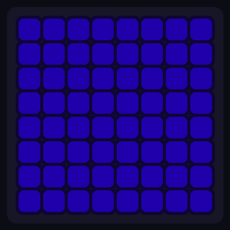
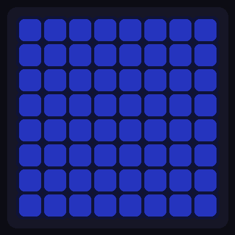
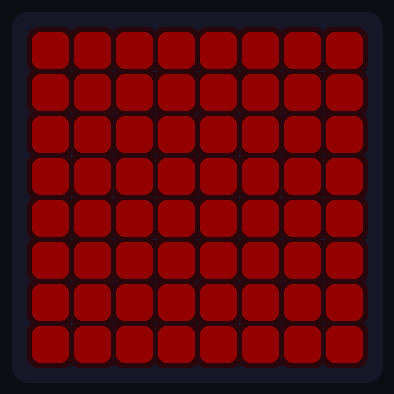
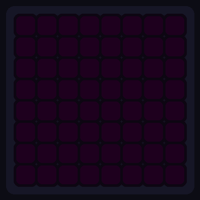

# ESP32-S3 Internet Monitor

An ESP32-S3 powered internet connectivity monitor featuring an 8x8 WS2812B RGB LED matrix. Continuously checks your connection and displays real-time status through color-coded animations — green when online, yellow when degraded, orange when offline. Choose from 5 animated effects (Solid, Ripple, Rainbow, Pulse, Rain), control everything via a secure web dashboard, and update firmware over-the-air. Perfect for a desk, server room, or anywhere you want instant visual feedback on your internet health.

<p align="center">
  
  
  
  <br>
  <b>Online</b> &nbsp;&nbsp;&nbsp;&nbsp;&nbsp;&nbsp;&nbsp;&nbsp;&nbsp;&nbsp;&nbsp;&nbsp;&nbsp;&nbsp;&nbsp;&nbsp;&nbsp;&nbsp;&nbsp;&nbsp;&nbsp;&nbsp;&nbsp;&nbsp;
  <b>Degraded</b> &nbsp;&nbsp;&nbsp;&nbsp;&nbsp;&nbsp;&nbsp;&nbsp;&nbsp;&nbsp;&nbsp;&nbsp;&nbsp;&nbsp;&nbsp;&nbsp;&nbsp;&nbsp;&nbsp;&nbsp;&nbsp;&nbsp;&nbsp;
  <b>Offline</b>
</p>

## Features

- **At-a-glance status** — color-coded LED matrix shows connection state instantly
- **Real-time monitoring** — checks connectivity every 10 seconds
- **False alarm prevention** — requires 2 consecutive failures before showing "down"
- **Watchdog timer** — auto-reboots if device hangs (60 second timeout)
- **5 LED effects** — Solid, Ripple, Rainbow, Pulse, Rain (plus Off)
- **Secure web dashboard** — session-based auth with rate-limited login
- **OTA updates** — update firmware over WiFi without USB

## Hardware

[Waveshare ESP32-S3-Matrix](https://www.waveshare.com/esp32-s3-matrix.htm)


- ESP32-S3 dual-core @ 240MHz
- 8x8 WS2812B RGB LED matrix (64 LEDs)
- USB-C for power and programming
- WiFi 2.4GHz

> ⚠️ **Warning:** Keep brightness ≤50 to prevent overheating.

## Quick Start

1. Set up Arduino IDE for ESP32-S3-Matrix: [Waveshare Wiki Guide](https://www.waveshare.com/wiki/ESP32-S3-Matrix#Working_with_Arduino)
2. Clone or download this repo, then **rename the folder to `InternetMonitor`** (Arduino requires the folder name to match the `.ino` filename)
3. Install **Adafruit NeoPixel** library via Library Manager
4. Edit `config.h` — set your WiFi credentials and web password
5. Upload to board
6. Check Serial Monitor (115200 baud) for IP address
7. Open IP in browser and login with your password

## How It Works

1. Every 10 seconds, sends HTTP request to `clients3.google.com/generate_204`
2. HTTP 204 response = internet OK
3. Falls back to secondary URL if first fails
4. Updates LED color based on result
5. Tracks statistics (resets on reboot)

## LED Display

### Status Colors

| Color | Meaning |
|-------|---------|
| 🟢 Green | Internet OK |
| 🟡 Yellow | Degraded (1 check failed) |
| 🟠 Orange | Internet down (2+ consecutive failures) |
| 🔴 Red | WiFi disconnected |
| 🔵 Blue | Booting / Connecting to WiFi |
| 🟣 Purple | OTA update in progress |

### Effects

| Effect | Description |
|--------|-------------|
| Solid | Static color, no animation |
| Ripple | Diagonal wave with accent color |
| Rainbow | Flowing rainbow (full color when online) |
| Pulse | Breathing between main and accent color |
| Rain | Falling droplets |

### Effect × Connectivity State

| Effect | Online | Degraded | Offline |
|:-------|:------:|:--------:|:-------:|
| **Solid** |  |  |  |
| **Ripple** |  |  |  |
| **Rainbow** |  |  |  |
| **Pulse** |  |  |  |
| **Rain** |  |  |  |

### System States

| Effect | Booting | Connecting | WiFi Lost | OTA |
|:-------|:------:|:--------:|:-------:|:---:|
| **Pulse** &nbsp;&nbsp;&nbsp;&nbsp;&thinsp; |  |  |  |  |

## Web Interface

Access via device IP address. Sessions persist until device reboots or you logout. Rate limiting locks out after 5 failed login attempts (1 minute cooldown).

**Login**


**Dashboard**


Controls:

- **Effect buttons** — select animation
- **Brightness slider** — 5 to 50
- **Speed slider** — 10% to 100%
- **Rotation buttons** — 0°, 90°, 180°, 270°

Statistics shown:
- Uptime, total checks, success rate
- Failed checks, total downtime, last outage duration
- WiFi SSID, IP address, signal strength (RSSI)

## Configuration

```
InternetMonitor/
├── InternetMonitor.ino   # Main logic, setup, loop
├── config.h              # WiFi, password, timing settings
├── effects.h             # LED effect functions
├── ui_login.h            # Login page HTML
└── ui_dashboard.h        # Dashboard HTML/CSS/JS
```

Edit `config.h` to customize:

```cpp
// WiFi
const char* WIFI_SSID     = "YourWiFiName";
const char* WIFI_PASSWORD = "YourPassword";

// Web UI
const char* WEB_PASSWORD  = "admin";

// Timing
#define CHECK_INTERVAL       10000  // Check every 10 seconds
#define WDT_TIMEOUT          60     // Watchdog timeout (seconds)
#define FAILURES_BEFORE_RED  2      // Consecutive failures before "down"
```

Default LED settings: Rain effect, brightness 21, speed 80%, rotation 180°

## API Endpoints

All endpoints except `/login` require a valid session cookie.

| Endpoint | Description |
|----------|-------------|
| `GET /` | Web dashboard (or login page) |
| `POST /login` | Authenticate (body: `password=xxx`) |
| `GET /logout` | End session |
| `GET /stats` | JSON stats |
| `GET /effect?e={0-5}` | Set effect |
| `GET /brightness?b={5-50}` | Set brightness |
| `GET /speed?s={10-100}` | Set speed |
| `GET /rotation?r={0-3}` | Set rotation |

## OTA Updates

After initial USB upload, future updates can be done over WiFi:

1. In Arduino IDE: Tools → Port → Select `internet-monitor` (network)
2. Upload as normal

## Troubleshooting

**No Serial output:** Set USB CDC On Boot to Enabled

**Wrong colors:** Verify `NEO_RGB` in code (not `NEO_GRB`)

**Won't connect to WiFi:** ESP32 only supports 2.4GHz networks

**Crashes when internet down:** Watchdog should auto-recover within 60 seconds

## License

MIT
