# ESP32-S3 Internet Monitor

<p align="center">
  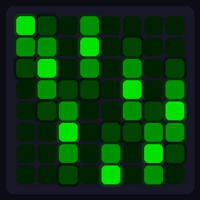
  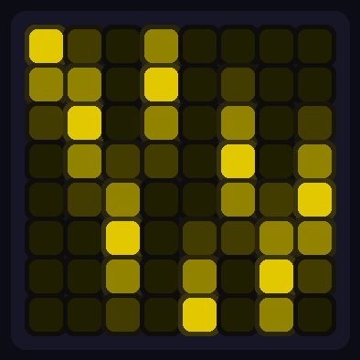
  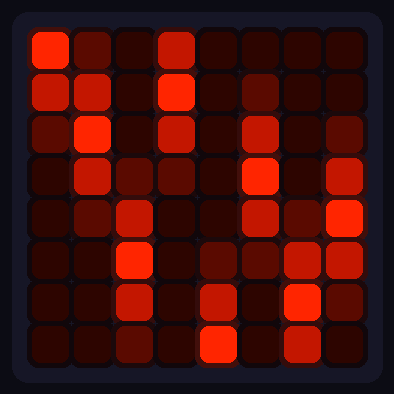
  <br>
  <b>Online</b> &nbsp;&nbsp;&nbsp;&nbsp;&nbsp;&nbsp;&nbsp;&nbsp;&nbsp;&nbsp;&nbsp;&nbsp;&nbsp;&nbsp;&nbsp;&nbsp;&nbsp;&nbsp;&nbsp;&nbsp;&nbsp;&nbsp;&nbsp;&nbsp;
  <b>Degraded</b> &nbsp;&nbsp;&nbsp;&nbsp;&nbsp;&nbsp;&nbsp;&nbsp;&nbsp;&nbsp;&nbsp;&nbsp;&nbsp;&nbsp;&nbsp;&nbsp;&nbsp;&nbsp;&nbsp;&nbsp;&nbsp;&nbsp;&nbsp;
  <b>Offline</b>
</p>

An ESP32-S3 powered internet connectivity monitor featuring an 8x8 WS2812B RGB LED matrix. Continuously checks your connection and displays real-time status through color-coded animations — green when online, yellow when degraded, red when offline. Choose from 18 animated effects, control everything via a secure web dashboard, and update firmware over-the-air. Perfect for a desk, server room, or anywhere you want instant visual feedback on your internet connection status.

## Features

- **At-a-glance status** — color-coded LED matrix shows connection state instantly
- **Real-time monitoring** — checks connectivity every 10 seconds
- **False alarm prevention** — requires 2 consecutive failures before showing "down"
- **Watchdog timer** — auto-reboots if device hangs (60 second timeout)
- **18 LED effects** — each with optimized default brightness and speed
- **WiFi provisioning** — configure WiFi via captive portal (no recompiling needed)
- **Persistent settings** — brightness, effect, speed, rotation saved to flash
- **Secure web dashboard** — session-based auth with rate-limited login
- **OTA updates** — update firmware over WiFi (uses same password as web UI)

## Hardware

[Waveshare ESP32-S3-Matrix](https://www.waveshare.com/esp32-s3-matrix.htm) — ESP32-S3 with built-in 8x8 WS2812B LED matrix.

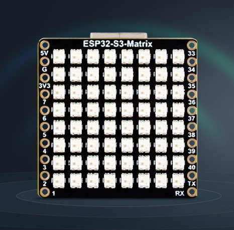

## Setup

### 1. Install

1. Set up Arduino IDE for ESP32-S3-Matrix: [Waveshare Wiki](https://www.waveshare.com/wiki/ESP32-S3-Matrix#Working_with_Arduino)
2. Install **Adafruit NeoPixel** library (Library Manager)
3. Download this repo and rename folder to `InternetMonitor`
4. Upload to board via USB

### 2. Configure WiFi

On first boot, the device creates its own WiFi network for setup:

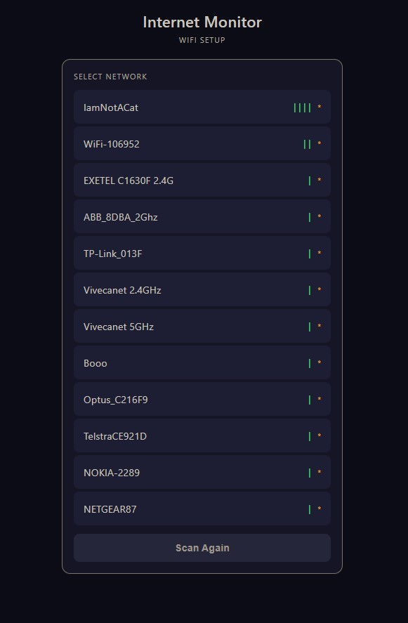

1. LEDs turn purple — device is in config mode
2. Connect your phone/laptop to WiFi network `InternetMonitor-Setup` (password: `admin`)
3. Open browser to `http://192.168.4.1`
4. Login with password `admin`
5. Select your WiFi network, enter its password, set a new admin password
6. Device reboots and connects to your WiFi

### 3. Use the Dashboard

Once connected, access the web dashboard at the device's IP (shown in Serial Monitor at 115200 baud).

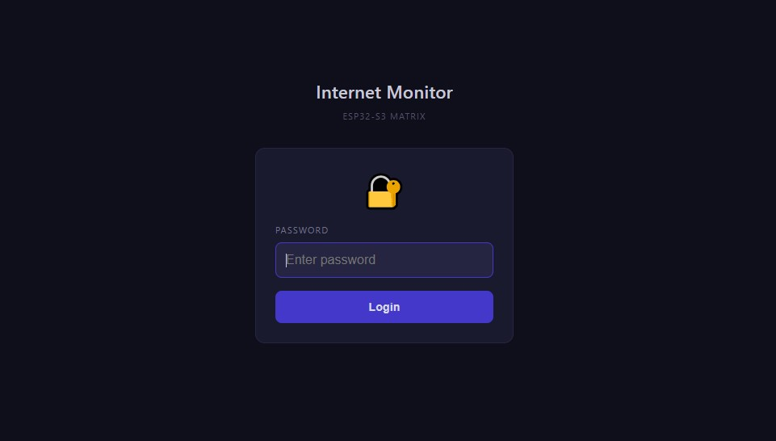

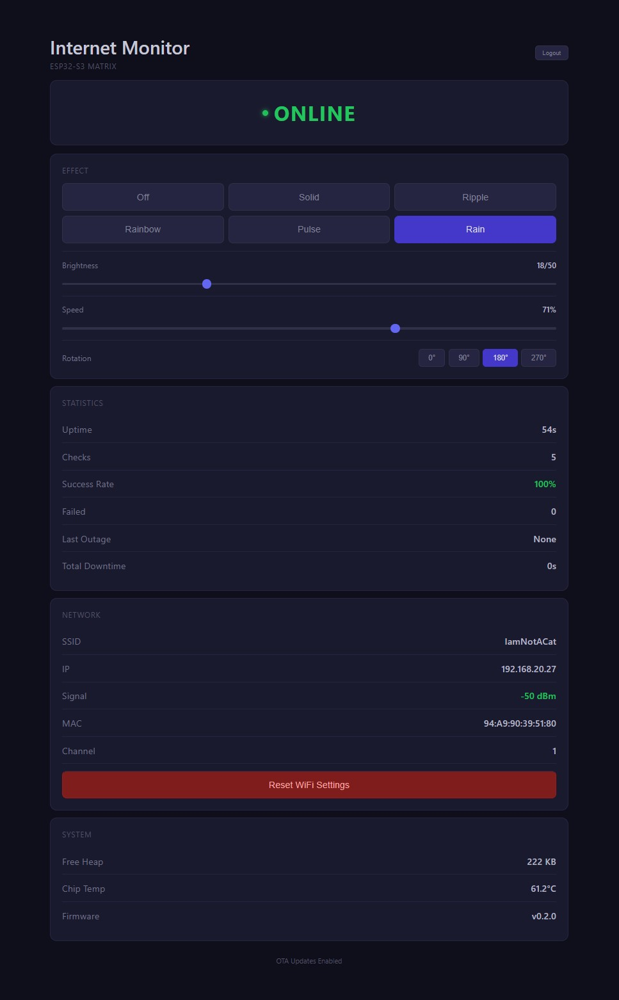

From here you can:
- Switch between 18 effects
- Adjust brightness, speed, rotation
- View connection statistics
- Factory reset (returns to config mode)

## Status Colors

| Color | Meaning |
|-------|---------|
| 🟢 Green | Internet OK |
| 🟡 Yellow | Degraded (1 check failed) |
| 🔴 Red | Internet down or WiFi lost |
| 🔵 Blue | Booting / Connecting |
| 🟣 Purple | Config mode (WiFi setup) |

## Effects

| | | | |
|:---:|:---:|:---:|:---:|
| Off | Solid | Ripple | Rainbow |
| Rain | Matrix | Fire | Plasma |
| Ocean | Nebula | Life | Pong |
| Metaballs | Interference | Noise | Pool |
| Rings | Ball | | |

<details>
<summary>Effect previews</summary>

| Effect | Online | Degraded | Offline |
|:-------|:------:|:--------:|:-------:|
| **Solid** | 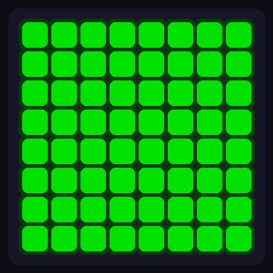 | 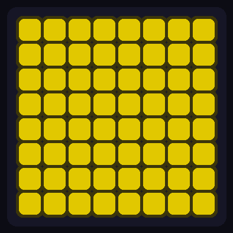 | 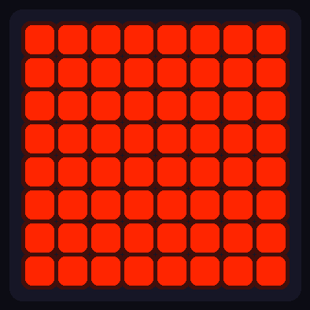 |
| **Ripple** | 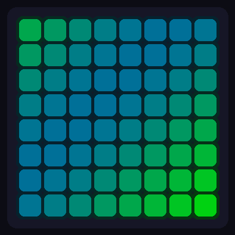 | 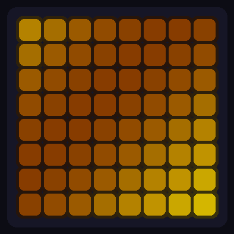 | 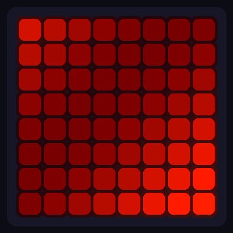 |
| **Rainbow** | 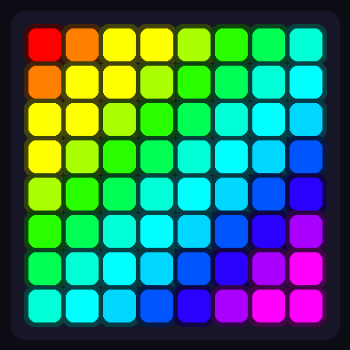 |  |  |
| **Rain** |  |  |  |

</details>

## Troubleshooting

| Problem | Solution |
|---------|----------|
| Can't find device WiFi | Make sure upload completed; try power cycling |
| Can't connect to 192.168.4.1 | Ensure you're connected to `InternetMonitor-Setup` network |
| Wrong LED colors | Check `NEO_RGB` in code (not `NEO_GRB`) |
| Won't connect to home WiFi | ESP32 only supports 2.4GHz networks |
| Forgot admin password | Hold boot button during startup for factory reset, or reflash via USB |

## Advanced

<details>
<summary>OTA Updates</summary>

After initial USB upload, update over WiFi:

1. Arduino IDE → Tools → Port → Select `internet-monitor at <ip>`
2. Enter admin password when prompted
3. Upload

</details>

<details>
<summary>Configuration Options</summary>

Edit `config.h`:

```cpp
const char* WEB_PASSWORD = "admin";      // Dashboard & OTA password

#define CHECK_INTERVAL      10000        // Connectivity check interval (ms)
#define FAILURES_BEFORE_RED 2            // Consecutive failures before "down"
#define WDT_TIMEOUT         60           // Watchdog timeout (seconds)
```

</details>

<details>
<summary>API Endpoints</summary>

All endpoints except `/login` require session cookie.

| Endpoint | Description |
|----------|-------------|
| `POST /login` | Authenticate |
| `GET /logout` | End session |
| `GET /stats` | JSON statistics |
| `GET /effect?e={0-17}` | Set effect |
| `GET /brightness?b={5-50}` | Set brightness |
| `GET /speed?s={10-100}` | Set speed |
| `GET /rotation?r={0-3}` | Set rotation |
| `GET /factory-reset` | Reset all settings |

</details>
