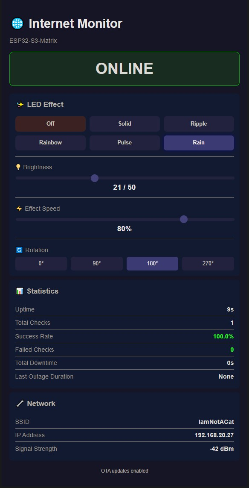

# ESP32-S3 Internet Monitor

A visual internet connectivity monitor using the Waveshare ESP32-S3-Matrix. Know your internet status at a glance — green means online, red means down.


## LED Status Colors

| Color | Meaning |
|-------|---------|
| 🟢 Green | Internet OK |
| 🟡 Yellow | Degraded (1 check failed) |
| 🟠 Orange | Internet down (2+ consecutive failures) |
| 🔴 Red | WiFi disconnected |
| 🔵 Blue | Booting / Connecting to WiFi |
| 🟣 Purple | OTA update in progress |

## Features

- **At-a-glance status** — color-coded LED matrix shows connection state instantly
- **Real-time monitoring** — checks connectivity every 10 seconds
- **False alarm prevention** — requires 2 consecutive failures before showing "down"
- **Watchdog timer** — auto-reboots if device hangs (60 second timeout)
- **6 LED effects** — Off, Solid, Ripple, Rainbow, Pulse, Rain
- **Password-protected web dashboard** — control effects, brightness, speed, and rotation
- **OTA updates** — update firmware over WiFi without USB

## Hardware

[Waveshare ESP32-S3-Matrix](https://www.waveshare.com/esp32-s3-matrix.htm)

- ESP32-S3 dual-core @ 240MHz
- 8x8 WS2812B RGB LED matrix (64 LEDs)
- USB-C for power and programming
- WiFi 2.4GHz

> ⚠️ **Warning:** Keep brightness ≤50 to prevent overheating.

## Quick Start

1. Set up Arduino IDE for ESP32-S3-Matrix: [Waveshare Wiki Guide](https://www.waveshare.com/wiki/ESP32-S3-Matrix#Working_with_Arduino)
2. Install **Adafruit NeoPixel** library via Library Manager
3. Edit `config.h` — set your WiFi credentials and web password:
   ```cpp
   const char* WIFI_SSID     = "YourWiFiName";
   const char* WIFI_PASSWORD = "YourPassword";
   const char* WEB_PASSWORD  = "admin";  // Change this!
   ```
4. Upload to board
5. Check Serial Monitor (115200 baud) for IP address
6. Open IP in browser and login with your password

## LED Effects

| Effect | Description |
|--------|-------------|
| Off | LEDs disabled |
| Solid | Static color, no animation |
| Ripple | Diagonal wave pattern |
| Rainbow | Flowing rainbow tinted by status color |
| Pulse | Breathing/fading animation |
| Rain | Falling droplets |

## Web Interface



Access via device IP address. Controls:

- **Effect buttons** — select animation
- **Brightness slider** — 5 to 50
- **Speed slider** — 10% to 100%
- **Rotation buttons** — 0°, 90°, 180°, 270°

Statistics shown:
- Uptime, total checks, success rate
- Failed checks, total downtime, last outage duration
- WiFi SSID, IP address, signal strength (RSSI)

## API Endpoints

| Endpoint | Description |
|----------|-------------|
| `GET /` | Web dashboard |
| `GET /stats` | JSON stats |
| `GET /effect?e={0-5}` | Set effect |
| `GET /brightness?b={5-50}` | Set brightness |
| `GET /speed?s={10-100}` | Set speed |
| `GET /rotation?r={0-3}` | Set rotation |

## OTA Updates

After initial USB upload, future updates can be done over WiFi:

1. In Arduino IDE: Tools → Port → Select `internet-monitor` (network)
2. Upload as normal

## Project Structure

```
InternetMonitor/
├── InternetMonitor.ino   # Main logic, setup, loop
├── config.h              # WiFi, password, timing settings
├── effects.h             # LED effect functions
├── ui_login.h            # Login page HTML
└── ui_dashboard.h        # Dashboard HTML/CSS/JS
```

## Configuration

Edit `config.h` to customize:

```cpp
// WiFi
const char* WIFI_SSID     = "YourWiFiName";
const char* WIFI_PASSWORD = "YourPassword";

// Web UI
const char* WEB_PASSWORD  = "admin";

// Timing
#define CHECK_INTERVAL       10000  // Check every 10 seconds
#define WDT_TIMEOUT          60     // Watchdog timeout (seconds)
#define FAILURES_BEFORE_RED  2      // Consecutive failures before "down"
```

Default LED settings: Rain effect, brightness 21, speed 80%, rotation 180°

## How It Works

1. Every 10 seconds, sends HTTP request to `clients3.google.com/generate_204`
2. HTTP 204 response = internet OK
3. Falls back to second URL if first fails
4. Updates LED color based on result
5. Tracks statistics (resets on reboot)

## Troubleshooting

**No Serial output:** Set USB CDC On Boot to Enabled

**Wrong colors:** Verify `NEO_RGB` in code (not `NEO_GRB`)

**Won't connect to WiFi:** ESP32 only supports 2.4GHz networks

**Crashes when internet down:** Watchdog should auto-recover within 60 seconds

## License

MIT
