# ESP32-S3 Internet Monitor

An ESP32-S3 powered internet connectivity monitor featuring an 8x8 WS2812B RGB LED matrix. Continuously checks your connection and displays real-time status through color-coded animations — green when online, yellow when degraded, orange when offline. Choose from 19 animated effects, control everything via a secure web dashboard, and update firmware over-the-air. Perfect for a desk, server room, or anywhere you want instant visual feedback on your internet health.

<p align="center">
  
  
  
  <br>
  <b>Online</b> &nbsp;&nbsp;&nbsp;&nbsp;&nbsp;&nbsp;&nbsp;&nbsp;&nbsp;&nbsp;&nbsp;&nbsp;&nbsp;&nbsp;&nbsp;&nbsp;&nbsp;&nbsp;&nbsp;&nbsp;&nbsp;&nbsp;&nbsp;&nbsp;
  <b>Degraded</b> &nbsp;&nbsp;&nbsp;&nbsp;&nbsp;&nbsp;&nbsp;&nbsp;&nbsp;&nbsp;&nbsp;&nbsp;&nbsp;&nbsp;&nbsp;&nbsp;&nbsp;&nbsp;&nbsp;&nbsp;&nbsp;&nbsp;&nbsp;
  <b>Offline</b>
</p>

## Features

- **Dual-core architecture** — LED effects on Core 0 (60fps), network on Core 1 (never blocks)
- **At-a-glance status** — color-coded LED matrix shows connection state instantly
- **Real-time monitoring** — checks connectivity every 10 seconds
- **False alarm prevention** — requires 2 consecutive failures before showing "down"
- **Watchdog timer** — auto-reboots if device hangs (60 second timeout)
- **19 LED effects** — Basic, Visual, and Animated categories
- **Secure web dashboard** — session-based auth with rate-limited login
- **Config portal** — captive portal for WiFi setup when not configured
- **Factory reset** — web UI button to clear all settings
- **OTA updates** — update firmware over WiFi without USB
- **Persistent settings** — brightness, effect, speed, rotation survive reboot

## Hardware

[Waveshare ESP32-S3-Matrix](https://www.waveshare.com/esp32-s3-matrix.htm)


- ESP32-S3 dual-core @ 240MHz
- 8x8 WS2812B RGB LED matrix (64 LEDs)
- USB-C for power and programming
- WiFi 2.4GHz

> ⚠️ **Warning:** Keep brightness ≤50 to prevent overheating.

## Quick Start

1. Set up Arduino IDE for ESP32-S3-Matrix: [Waveshare Wiki Guide](https://www.waveshare.com/wiki/ESP32-S3-Matrix#Working_with_Arduino)
2. Clone or download this repo, then **rename the folder to `InternetMonitor`** (Arduino requires the folder name to match the `.ino` filename)
3. Install **Adafruit NeoPixel** library via Library Manager
4. Edit `config.h` — set your WiFi credentials and web password
5. Upload to board
6. Check Serial Monitor (115200 baud) for IP address
7. Open IP in browser and login with your password

## State Machine

The monitor operates as a state machine with automatic transitions based on WiFi and internet connectivity:

```mermaid
stateDiagram-v2
    [*] --> BOOTING: Power on
    
    BOOTING --> CONNECTING_WIFI: Init complete
    BOOTING --> CONFIG_PORTAL: No credentials
    
    CONNECTING_WIFI --> INTERNET_OK: WiFi + Internet OK
    CONNECTING_WIFI --> CONFIG_PORTAL: WiFi timeout (20s)
    
    CONFIG_PORTAL --> CONNECTING_WIFI: Credentials saved
    CONFIG_PORTAL --> [*]: Timeout (10min) → Reboot
    
    INTERNET_OK --> INTERNET_DEGRADED: 1 check failed
    INTERNET_OK --> WIFI_LOST: WiFi disconnected
    
    INTERNET_DEGRADED --> INTERNET_OK: Check passed
    INTERNET_DEGRADED --> INTERNET_DOWN: 2+ consecutive failures
    INTERNET_DEGRADED --> WIFI_LOST: WiFi disconnected
    
    INTERNET_DOWN --> INTERNET_OK: Check passed
    INTERNET_DOWN --> WIFI_LOST: WiFi disconnected
    
    WIFI_LOST --> INTERNET_OK: WiFi reconnected + check passed
    WIFI_LOST --> CONFIG_PORTAL: Manual trigger
```



### State Colors

| State | Color | RGB | Description |
|-------|-------|-----|-------------|
| BOOTING | 🔵 Blue | 0, 0, 80 | System starting up |
| CONNECTING_WIFI | 🔵 Cyan-Blue | 0, 40, 80 | Attempting WiFi connection |
| CONFIG_PORTAL | 🟣 Purple | 40, 0, 80 | AP mode, awaiting setup |
| WIFI_LOST | 🔴 Red | 100, 0, 0 | WiFi disconnected |
| INTERNET_OK | 🟢 Green | 0, 80, 0 | All checks passing |
| INTERNET_DEGRADED | 🟡 Yellow | 80, 60, 0 | 1 check failed |
| INTERNET_DOWN | 🟠 Orange | 100, 20, 0 | 2+ consecutive failures |

## How It Works

1. Every 10 seconds, sends HTTP request to `clients3.google.com/generate_204`
2. HTTP 204 response = internet OK
3. Falls back to secondary URL if first fails
4. Updates LED color based on result
5. Tracks statistics (resets on reboot)

## LED Effects

### Categories

| Category | Effects |
|----------|---------|
| **Basic** | Off, Solid, Ripple, Rainbow, Pulse, Rain |
| **Visual** | Matrix, Fire, Plasma, Ocean, Nebula, Noise |
| **Animated** | Life, Pong, Metaballs, Interference, Pool, Rings, Ball |

### Effect × Connectivity State

| Effect | Online | Degraded | Offline |
|:-------|:------:|:--------:|:-------:|
| **Solid** |  |  |  |
| **Ripple** |  |  |  |
| **Rainbow** |  |  |  |
| **Pulse** |  |  |  |
| **Rain** |  |  |  |

### System States

| Effect | Booting | Connecting | WiFi Lost | OTA |
|:-------|:------:|:--------:|:-------:|:---:|
| **Pulse** &nbsp;&nbsp;&nbsp;&nbsp;&thinsp; |  |  |  |  |

## Web Interface

Access via device IP address. Sessions persist until device reboots or you logout. Rate limiting locks out after 5 failed login attempts (1 minute cooldown).

**Login**


**Dashboard**


Controls:

- **Effect buttons** — select animation (organized by category)
- **Brightness slider** — 5 to 50
- **Speed slider** — 10% to 100%
- **Rotation buttons** — 0°, 90°, 180°, 270°
- **Factory Reset** — clears all settings, reboots to setup mode

Statistics shown:
- Uptime, total checks, success rate
- Failed checks, total downtime, last outage duration
- WiFi SSID, IP address, signal strength (RSSI)
- LED FPS, frame time, stack usage (Performance section)

## Project Structure

```
InternetMonitor/
├── InternetMonitor.ino   # Main logic, setup, loop, web handlers
├── config.h              # WiFi, passwords, timing, colors, constants
├── effects.h             # Effect dispatcher
├── effects/
│   ├── effects_base.h    # Shared utilities (fast math, pixel API)
│   ├── effect_solid.h    # Basic effects
│   ├── effect_ripple.h
│   ├── effect_fire.h     # Visual effects
│   ├── effect_plasma.h
│   ├── effect_life.h     # Animated effects
│   ├── effect_pong.h
│   └── ... (19 total)
├── web/
│   ├── ui_login.h        # Login page HTML
│   ├── ui_dashboard.h    # Dashboard CSS/JS
│   └── ui_portal.h       # Config portal CSS/JS
├── CHANGELOG.md          # Version history
└── README.md
```

## Configuration

Edit `config.h` to customize:

```cpp
// WiFi
const char* WIFI_SSID     = "YourWiFiName";
const char* WIFI_PASSWORD = "YourPassword";

// Web UI
const char* WEB_PASSWORD  = "admin";

// Timing
#define CHECK_INTERVAL       10000  // Check every 10 seconds
#define WDT_TIMEOUT          60     // Watchdog timeout (seconds)
#define FAILURES_BEFORE_RED  2      // Consecutive failures before "down"

// State colors (customize LED colors for each state)
#define COLOR_OK_R            0
#define COLOR_OK_G            80
#define COLOR_OK_B            0
```

Default LED settings: Rain effect, brightness 21, speed 80%, rotation 180°

## API Endpoints

All endpoints except `/login` require a valid session cookie.

| Endpoint | Description |
|----------|-------------|
| `GET /` | Web dashboard (or login page) |
| `POST /login` | Authenticate (body: `password=xxx`) |
| `GET /logout` | End session |
| `GET /stats` | JSON stats |
| `GET /effect?e={0-18}` | Set effect |
| `GET /brightness?b={5-50}` | Set brightness |
| `GET /speed?s={10-100}` | Set speed |
| `GET /rotation?r={0-3}` | Set rotation |
| `GET /factory-reset` | Clear all settings and reboot |

## OTA Updates

After initial USB upload, future updates can be done over WiFi:

1. In Arduino IDE: Tools → Port → Select `internet-monitor` (network)
2. Upload as normal

## Troubleshooting

**No Serial output:** Set USB CDC On Boot to Enabled

**Wrong colors:** Verify `NEO_RGB` in code (not `NEO_GRB`)

**Won't connect to WiFi:** ESP32 only supports 2.4GHz networks

**Crashes when internet down:** Watchdog should auto-recover within 60 seconds

**Effect looks wrong after switching:** Effects now reset their state on switch (v0.6.0+)

## License

MIT
